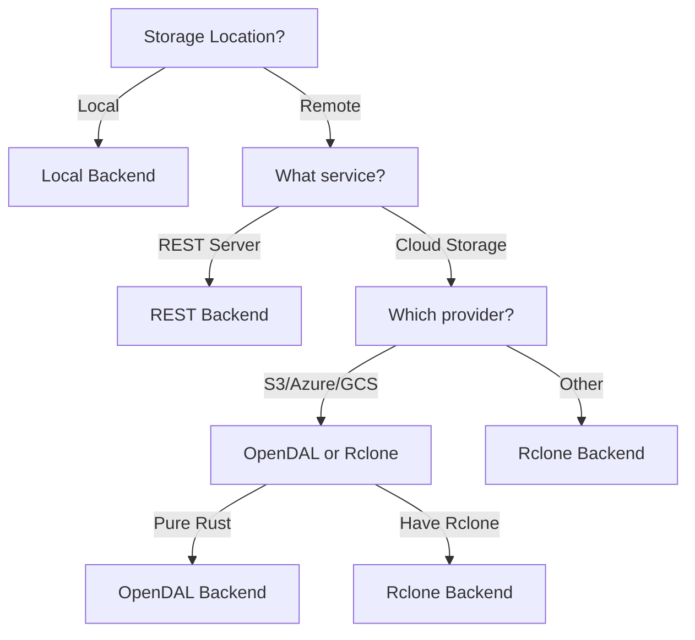

A **backend** is rustic_core's abstraction layer for storing repository data. Backends enable rustic to work with diverse storage systems while maintaining the same repository format.

## What is a Backend?

Backends provide a simple interface to storage:

<CardGroup cols={2}>
  <Card title="Read Operations" icon="download">
    - List files by type
    - Read full files
    - Read partial data (ranges)
    - Check file sizes
  </Card>
  
  <Card title="Write Operations" icon="upload">
    - Write files
    - Delete files
    - Create repository structure
  </Card>
</CardGroup>

<Note>
All backends provide the same interface, so switching storage doesn't require application changes.
</Note>

## Backend Traits

rustic_core defines two core traits:

### ReadBackend

```rust
pub trait ReadBackend: Send + Sync {
    /// Get backend location string
    fn location(&self) -> String;
    
    /// List all files of a given type with sizes
    fn list_with_size(&self, tpe: FileType) -> RusticResult<Vec<(Id, u32)>>;
    
    /// Read entire file
    fn read_full(&self, tpe: FileType, id: &Id) -> RusticResult<Bytes>;
    
    /// Read partial file (offset + length)
    fn read_partial(
        &self,
        tpe: FileType,
        id: &Id,
        cacheable: bool,
        offset: u32,
        length: u32,
    ) -> RusticResult<Bytes>;
    
    // ... warm-up methods
}
```

### WriteBackend

```rust
pub trait WriteBackend: ReadBackend {
    /// Create repository structure
    fn create(&self) -> RusticResult<()>;
    
    /// Write file data
    fn write_bytes(
        &self,
        tpe: FileType,
        id: &Id,
        cacheable: bool,
        buf: Bytes,
    ) -> RusticResult<()>;
    
    /// Remove file
    fn remove(
        &self,
        tpe: FileType,
        id: &Id,
        cacheable: bool,
    ) -> RusticResult<()>;
}
```

<Tip>
`WriteBackend` extends `ReadBackend`, so all backends that support writes also support reads.
</Tip>

## Available Backends

rustic_core supports four backend types:

<Tabs>
  <Tab title="Local">
    **Local filesystem backend** - Stores repository on local or mounted filesystems.
    
    ```rust
    use rustic_backend::LocalBackend;
    
    let backend = LocalBackend::new("/path/to/repository")?;
    ```
    
    **Features:**
    - Direct filesystem access
    - No network overhead
    - Simple and fast
    - Works with NFS, SMB, etc.
    
    **Best for:**
    - Local backups
    - Network-attached storage (NAS)
    - Testing and development
  </Tab>
  
  <Tab title="REST">
    **REST backend** - Connects to rustic/restic REST servers.
    
    ```rust
    use rustic_backend::RestBackend;
    
    let backend = RestBackend::new(
        "https://backup-server.example.com/repo"
    )?;
    ```
    
    **Features:**
    - HTTP(S) protocol
    - Authentication support
    - Compatible with restic REST server
    - TLS encryption in transit
    
    **Best for:**
    - Remote backups
    - Self-hosted backup servers
    - Centralized backup infrastructure
  </Tab>
  
  <Tab title="Rclone">
    **Rclone backend** - Uses rclone for 40+ cloud providers.
    
    ```rust
    use rustic_backend::RcloneBackend;
    
    let backend = RcloneBackend::new(
        "rclone:s3:bucket-name/path"
    )?;
    ```
    
    **Supported services:**
    - Amazon S3, B2, Azure, GCS
    - Dropbox, Google Drive, OneDrive  
    - SFTP, FTP, WebDAV
    - 40+ others via rclone
    
    **Features:**
    - Leverage existing rclone configs
    - Wide cloud provider support
    - Rclone's transfer optimizations
    
    **Best for:**
    - Cloud storage without direct SDK
    - Existing rclone users
    - Services without native support
  </Tab>
  
  <Tab title="OpenDAL">
    **OpenDAL backend** - Native support for multiple cloud providers.
    
    ```rust
    use rustic_backend::OpenDALBackend;
    
    let backend = OpenDALBackend::new(
        "s3://bucket-name/path"
    )?;
    ```
    
    **Supported services:**
    - Amazon S3
    - Azure Blob Storage  
    - Google Cloud Storage
    - And more via OpenDAL
    
    **Features:**
    - Native Rust implementation
    - No external dependencies
    - Optimized for each provider
    - Better error handling
    
    **Best for:**
    - Cloud-native deployments
    - Embedded applications
    - When avoiding system dependencies
  </Tab>
</Tabs>

## Choosing a Backend

Decision matrix for selecting the right backend:



### Backend Comparison

| Backend | Setup | Dependencies | Performance | Providers |
|---------|-------|--------------|-------------|------------|
| **Local** | Simple | None | Fastest | Filesystem |
| **REST** | Medium | REST server | Fast | REST API |
| **OpenDAL** | Medium | None | Fast | 10+ clouds |
| **Rclone** | Complex | rclone binary | Good | 40+ services |

## Backend Configuration

Configure backends using `BackendOptions`:

```rust
use rustic_backend::{BackendOptions, SupportedBackend};

let opts = BackendOptions {
    repository: Some("/backup/repo".to_string()),
    repo_hot: None,  // Optional hot repository
    ..Default::default()
};

let backend = opts.to_backend()?;
```

### Hot/Cold Backend Setup

Combine fast and slow storage:

```rust
let opts = BackendOptions {
    repository: Some("s3://cold-archive/repo".to_string()),
    repo_hot: Some("/fast/ssd/cache".to_string()),
    ..Default::default()  
};

let backends = opts.to_backends()?;
let repo = Repository::new(&repo_opts, &backends)?;
```

See the [Repository hot/cold architecture](/concepts/repository#hotcold-repository-architecture) for details.

## Backend Operations

### File Types

Backends organize files by type:

```rust
pub enum FileType {
    Config,    // Repository configuration
    Index,     // Blob indexes
    Key,       // Encryption keys
    Snapshot,  // Snapshot metadata  
    Pack,      // Data packs
}
```

Each type is stored in a separate directory:

```
repository/
├── config
├── keys/
├── snapshots/
├── index/
└── data/
```

### Listing Files

```rust
// List all snapshots
let snapshots = backend.list(FileType::Snapshot)?;

for id in snapshots {
    println!("Snapshot: {}", id);
}

// List with sizes
let packs = backend.list_with_size(FileType::Pack)?;

for (id, size) in packs {
    println!("Pack {}: {} bytes", id, size);
}
```

### Reading Data

```rust
// Read entire file
let data = backend.read_full(FileType::Snapshot, &snapshot_id)?;

// Read partial (for large pack files)
let chunk = backend.read_partial(
    FileType::Pack,
    &pack_id,
    true,      // cacheable
    offset,
    length,
)?;
```

### Writing Data

```rust
use bytes::Bytes;

let data = Bytes::from("snapshot data");

backend.write_bytes(
    FileType::Snapshot,
    &snapshot_id,
    true,  // cacheable
    data,
)?;
```

## Caching

rustic_core includes a sophisticated caching layer:

### What Gets Cached?

<Tabs>
  <Tab title="Always Cached">
    ✅ **Small, frequently accessed files:**
    - Snapshots
    - Index files
    - Tree blobs
    - Config file
    
    These are marked `cacheable: true`.
  </Tab>
  
  <Tab title="Never Cached">
    ❌ **Large, infrequently accessed files:**
    - Data pack files
    - Large blobs
    
    These are marked `cacheable: false` to save disk space.
  </Tab>
</Tabs>

### Cache Location

Default cache locations:

| Platform | Default Cache Directory |
|----------|-------------------------|
| **Linux** | `~/.cache/rustic/` |
| **macOS** | `~/Library/Caches/rustic/` |
| **Windows** | `%LOCALAPPDATA%\rustic\cache\` |

Override with:

```rust
let opts = RepositoryOptions {
    cache_dir: Some("/custom/cache".into()),
    ..Default::default()
};
```

Or disable:

```rust
let opts = RepositoryOptions {
    no_cache: true,
    ..Default::default()  
};
```

## Warm-Up Support

Some backends (especially cold storage) support **warm-up** to pre-fetch data:

```rust
// Check if warm-up is needed
if backend.needs_warm_up() {
    // Trigger warm-up for pack file
    backend.warm_up(FileType::Pack, &pack_id)?;
}
```

### Warm-Up Commands

Configure custom warm-up commands:

```rust
let opts = RepositoryOptions {
    warm_up_command: Some(CommandInput::from_str(
        "glacier restore --archive-id %id"
    )?),
    warm_up_wait: Some(Duration::from_secs(3600)),  // Wait 1 hour
    ..Default::default()
};
```

<Note>
Warm-up is useful for:
- Glacier/Archive tier storage
- Tape archives
- Tiered cloud storage
</Note>

## Error Handling

Backends return typed errors:

```rust
match backend.read_full(FileType::Snapshot, &id) {
    Ok(data) => process_snapshot(data),
    Err(e) if e.kind() == ErrorKind::NotFound => {
        println!("Snapshot not found");
    }
    Err(e) if e.kind() == ErrorKind::Network => {
        println!("Network error, retrying...");
        retry_with_backoff()?;
    }
    Err(e) => return Err(e),
}
```

## Backend Features

Enable backends via Cargo features:

```toml
[dependencies]
rustic_backend = { version = "0.1", features = ["opendal", "rest"] }

# Or enable all
rustic_backend = { version = "0.1", features = ["cli"] }
```

Available features:
- `opendal` - OpenDAL backend (default)
- `rest` - REST backend (default)
- `rclone` - Rclone backend (default)  
- `cli` - Command-line support

## Advanced: Custom Backends

Implement custom backends by implementing the traits:

```rust
use rustic_core::backend::{ReadBackend, WriteBackend};

struct MyBackend {
    // Your storage implementation
}

impl ReadBackend for MyBackend {
    fn location(&self) -> String {
        "my-custom-backend".to_string()
    }
    
    fn list_with_size(&self, tpe: FileType) -> RusticResult<Vec<(Id, u32)>> {
        // Your implementation
    }
    
    // ... implement other methods
}

impl WriteBackend for MyBackend {
    fn create(&self) -> RusticResult<()> {
        // Create repository structure
    }
    
    // ... implement write methods
}
```

<Tip>
Custom backends enable:
- Integration with proprietary storage
- Custom caching strategies
- Specialized optimizations
- Compliance requirements
</Tip>

## Backend Best Practices

<AccordionGroup>
  <Accordion title="Connection Pooling" icon="link">
    Reuse backend instances for better performance:
    
    ```rust
    // Good: Reuse backend
    let backend = Arc::new(backend);
    for file in files {
        backend.write_bytes(tpe, &id, true, data)?;
    }
    
    // Bad: Create new backend each time
    for file in files {
        let backend = LocalBackend::new(path)?;
        backend.write_bytes(tpe, &id, true, data)?;
    }
    ```
  </Accordion>
  
  <Accordion title="Error Retry Logic" icon="rotate">
    Implement exponential backoff for transient failures:
    
    ```rust
    let mut retries = 0;
    let max_retries = 3;
    
    loop {
        match backend.read_full(tpe, &id) {
            Ok(data) => break Ok(data),
            Err(e) if retries < max_retries && e.is_transient() => {
                retries += 1;
                sleep(Duration::from_secs(2_u64.pow(retries)));
            }
            Err(e) => break Err(e),
        }
    }
    ```
  </Accordion>
  
  <Accordion title="Parallel Operations" icon="gauge">
    Backends are thread-safe (Send + Sync):
    
    ```rust
    use rayon::prelude::*;
    
    let backend = Arc::new(backend);
    
    file_ids.par_iter().try_for_each(|id| {
        let data = backend.read_full(FileType::Pack, id)?;
        process_data(data)
    })?;
    ```
  </Accordion>
</AccordionGroup>

## See Also

<CardGroup cols={2}>
  <Card title="Repository" icon="database" href="./repository">
    How backends store repository structure
  </Card>
  <Card title="Encryption" icon="lock" href="./encryption">
    Data encryption before backend storage
  </Card>
  <Card title="Deduplication" icon="compress" href="./deduplication">
    How backends store deduplicated packs
  </Card>
  <Card title="Snapshots" icon="camera" href="./snapshots">
    Snapshot metadata in backend storage
  </Card>
</CardGroup>